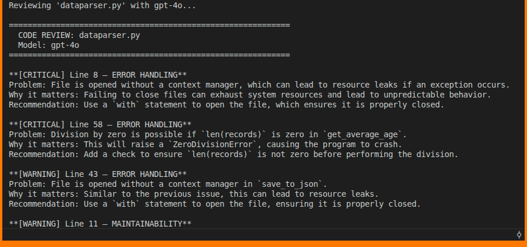

# **How to use the OpenAI Python SDK to Review Your Own Python Code**

You’ve just finished writing a Python function. Your tests pass, but you still wonder: Is the error handling robust? Did you miss an edge case? Is there a more Pythonic way to structure this?

Instead of copying code into a browser-based chat tool, you can integrate OpenAI directly into your Python workflow. By calling the API from your own script, you decide what is sent, how the model should respond, and where the output goes. The result can be printed to your terminal, written to a file, attached to a Slack message, or included in a CI report.

In this tutorial, you'll learn:

* What the OpenAI Python SDK is  
* How to set it up in your Python environment  
* How to use it to automate code review in your own projects

# **Prerequisites**

* You'll need an OpenAI account with a funded API key. Create one at [platform.openai.com/api-keys](https://platform.openai.com/api-keys). Add credits at [platform.openai.com/account/billing](https://platform.openai.com/account/billing) before proceeding.  
* Familiarity with OpenAI’s Python API, [openai](https://github.com/openai/openai-python).  
* Basic Python knowledge

# What the OpenAI Python SDK Is

The `openai` package is the official Python client for OpenAI's API. It gives you programmatic access to GPT-5.2, GPT-4o, GPT-4o mini, and [other models](https://developers.openai.com/api/docs/models) directly from your Python code. It handles API requests, responses, and model configuration so you don’t need to write raw HTTP code. You can use it to generate text, summaries, classifications, and more.

For this project, your working directory will contain the following files:

```
code-reviewer/   
├── data_parser.py
├── users.csv
└── review.py
```
You can find these here:

* [data_parser.py](dataparser.py)
* [users.csv](users.csv)
* [review.py](review.py)

# Step1: Create and Activate a Virtual Environment

Create and activate a virtual environment: 

```Python
python3 -m venv .venv  
source .venv/bin/activate
```
# Step 2: Store your API key 

Generate an API key from your OpenAI dashboard and store it as an environment variable:

`export OPENAI_API_KEY="your-api-key-here"`

The SDK will read `OPENAI_API_KEY` from your environment automatically, so you don't need to pass it explicitly when initializing the client.

# Step 3: Create an Automated Code Reviewer Script

Now you’ll build `review.py`. This script will:

* Read a Python file from disk
* Load its contents into a string
* Send that string to the GPT-4o model with a structured review prompt
* Print the model’s feedback to your terminal

Add the following code:

```Python
# data_parser.py

import csv
import json
import os


def read_csv(filepath):
    """Read a CSV file and return a list of rows as dictionaries."""
    rows = []
    f = open(filepath, "r")
    reader = csv.DictReader(f)
    for row in reader:
        rows.append(row)
    f.close()
    return rows


def parse_json(data):
    """Parse a JSON string and return a Python dictionary."""
    result = json.loads(data)
    return result


def normalize_age(records):
    """Convert age field from string to integer in a list of records."""
    for record in records:
        record["age"] = int(record["age"])
    return records


def filter_by_country(records, country):
    """Return records where country field matches the given value."""
    filtered = []
    for record in records:
        if record["country"] == country:
            filtered.append(record)
    return filtered


def save_to_json(records, output_path):
    """Save a list of records to a JSON file."""
    f = open(output_path, "w")
    json.dump(records, f)
    f.close()


def get_average_age(records):
    """Calculate the average age from a list of records."""
    total = 0
    for record in records:
        total += record["age"]
    average = total / len(records)
    return average


def load_and_process(filepath, country):
    """
    Full pipeline: load CSV, normalize ages,
    filter by country, and return results.
    """
    records = read_csv(filepath)
    records = normalize_age(records)
    filtered = filter_by_country(records, country)
    return filtered


if __name__ == "__main__":
    data = load_and_process("users.csv", "Kenya")
    print(f"Matched records: {len(data)}")
    print(f"Average age: {get_average_age(data)}")

```

Run it against any file in your project:  
`python review.py data_parser.py`

**Sample output:**



GPT-4o reads the full source, applies the three review criteria we have specified, and returns actionable feedback tied to your actual code.

Notice the `system` message in the request. This is where you establish the model's role and constraints *before* sending the code. Separating the reviewer's persona ("experienced Python developer," "do not rewrite the code") from the actual task keeps your prompts cleaner and produces more consistent responses across different files.

# **Why This Fits Into Your Python Workflow**

The primary advantage over a browser-based interface is programmability. Because the API call lives in Python, you can:

* Review multiple files before a commit
* Pipe feedback into pull request comments
* Adjust review strictness based on file type
* Integrate checks into CI pipelines

You're also in full control of what gets sent. You can define precise, structured instructions that produce more targeted feedback than a generic “review this” request.

# **When It's Not the Right Tool**

The SDK is a strong fit when you want **repeatable, scriptable AI assistance** embedded in your existing Python tooling. It's less suited to exploratory conversations where you need back-and-forth clarification, for that, the ChatGPT interface is faster and more natural.

Cost is also worth considering. Each API call uses tokens, and large files or detailed prompts add up. If you're reviewing hundreds of files in a CI pipeline, evaluate whether `gpt-4o` meets your quality bar at a fraction of the cost.

Finally, treat GPT-4o's output as a starting point, not a final verdict. Read every suggestion critically and apply your own judgment before accepting any change, especially in security-sensitive or performance-critical code. The model can miss context that only you have, and it occasionally flags correct code as problematic.

# **Final Thoughts**

After building the basic review script, you can explore streaming responses for large files or structured outputs such as JSON. Structured responses allow you to parse suggestions programmatically and filter them by severity before presenting them to your team.

By embedding AI directly into your Python workflow, you transform code review from a manual task into a repeatable, scriptable process under your control.

